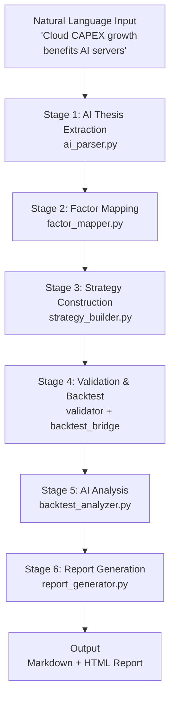

# AI Research Pipeline — LXL·QuantAxis V2

## Overview

The AI Research Pipeline is the core innovation of LXL·QuantAxis V2. It converts unstructured natural language investment ideas into structured, validated, and documented research output through six sequential stages.

## Pipeline Flow



## Stage Details

### Stage 1: AI Thesis Extraction (`ai_parser.py`)

**What it does**: Parses free-text investment notes into structured `InvestmentThesis` objects.

**How it works**:
- LLM mode: Sends text to LLM with structured extraction prompt, parses JSON response
- Rule mode: Uses keyword heuristics for Chinese/English investment terms
- Output: symbol, title, core_argument, bullish_reasons, bearish_reasons, key_risks, conviction, style

**Example**:
```
Input:  "看好AI服务器产业链。云厂商资本开支提升利好。风险：估值过高。"

Output: {
  symbol: "AI_server",
  core_argument: "云厂商资本开支提升驱动算力需求",
  bullish_reasons: "云厂商资本开支提升",
  bearish_reasons: "估值过高",
  key_risks: "估值过高",
  conviction: "high",
  investment_style: "growth"
}
```

### Stage 2: Factor Mapping (`factor_mapper.py`)

**What it does**: Maps investment thesis to concrete factors from the existing 28-factor registry.

**How it works**:
- LLM mode: Full FACTOR_REGISTRY in prompt, LLM selects most relevant factors
- Rule mode: 6 style-to-factor templates (value→mean_reversion, growth→momentum, etc.)
- Output: FactorModel with weighted factors, rationale, confidence

**Style-to-Factor Templates**:

| Style | Primary Factors | Weight Distribution |
|-------|----------------|-------------------|
| growth | momentum_score, trend_strength, roc_10 | 30/25/25% |
| value | ma_deviation, bollinger_pos, volatility | 35/25/20% |
| momentum | momentum_score, roc_10, rsi_norm | 35/25/25% |
| macro | trend_strength, bollinger_width, volatility | 35/25/25% |
| event_driven | volume_ratio, rsi_norm, atr_ratio | 40/30/30% |

### Stage 3: Strategy Construction (`strategy_builder.py`)

**What it does**: Converts factor model into a compilable `StrategySpec` using declarative DSL.

**DSL rules are simple conditional strings**:
```
entry: "momentum_score > 0.6 AND trend_strength > 0.5"
exit:  "max_drawdown > 0.10"
risk:  max_drawdown_pct=10%, stop_loss_pct=5%
```

**Safety**: Rules pass through token blocklist → AST validation → factor whitelist check before compilation.

### Stage 4: Validation & Backtest (`validator.py` + `backtest_bridge.py`)

**What it does**: Validates the strategy spec, compiles it, and runs it through the backtest engine.

**Validation checks**:
1. Rule syntax (AST parse)
2. Factor existence (all names in FACTOR_REGISTRY)
3. Data availability (standard OHLCV columns)
4. Parameter ranges
5. Risk rule legality

**Backtest bridge**: `validate → compile → BacktestEngine.run() → metrics`

### Stage 5: AI Analysis (`backtest_analyzer.py`)

**What it does**: Produces human-readable assessment of backtest results.

**Assessment fields**: summary, strengths, weaknesses, risk_warning, optimization_suggestions

**Grading thresholds**:
- Sharpe > 1.5: Excellent
- Sharpe > 0.5: Viable
- Sharpe > 0: Marginal
- Sharpe ≤ 0: Ineffective

### Stage 6: Report Generation (`report_generator.py`)

**What it does**: Combines all pipeline outputs into an institutional research report.

**Report sections**:
1. Investment Summary
2. Investment Thesis
3. Factor Analysis (with weight table)
4. Strategy Construction (with entry/exit rules)
5. Backtest Results (with metrics table)
6. Portfolio Analysis (with allocation table)
7. Risk Analysis
8. Conclusion

**Output formats**: Markdown (.md) and styled HTML (.html)

## Running the Pipeline

```bash
# One command
python demo_ai_research.py "Your investment thesis"

# Or via Web UI
open http://127.0.0.1:5000/research
```

## Fallback Behavior

When LLM is unavailable (no API key configured), all stages gracefully degrade to rule-based mode. The pipeline never fails due to LLM unavailability. Rule-based mode produces deterministic, reproducible results suitable for testing and offline use.
