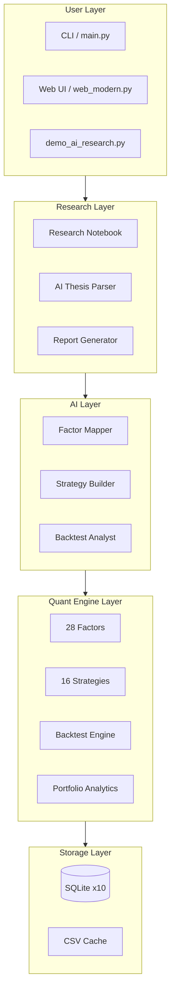
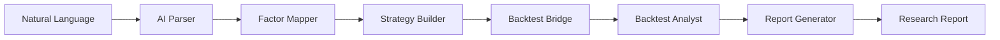
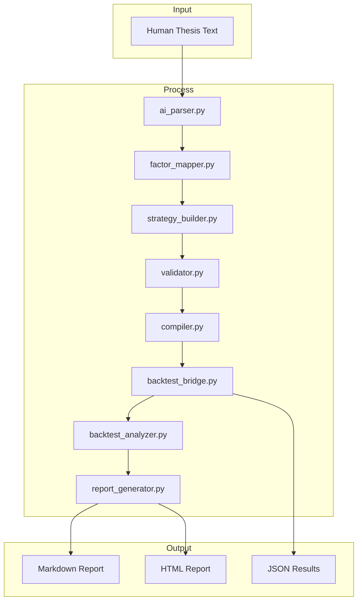

# LXL·QuantAxis V2 Architecture

> AI-Native Quantitative Investment Research Platform

## 1. System Overview

LXL·QuantAxis transforms human investment intuition into validated quantitative research through a layered architecture. Each layer has a single responsibility and communicates through well-defined interfaces.

**Core idea**:

```
Human Investment Thesis
        ↓
   AI Understanding (ai_parser)
        ↓
   Quant Modeling (factor_mapper, strategy_builder)
        ↓
   Validation (backtest_analyzer)
        ↓
   Research Output (report_generator)
```

## 2. High-Level Architecture



## 3. AI Research Pipeline

The pipeline converts unstructured text into validated research through six stages:



### 3.1 ai_parser — Thesis Extraction

| Aspect | Detail |
|--------|--------|
| Input | Free-text investment note |
| Output | `ParsedThesis` with symbol, core argument, bull/bear cases, risks |
| LLM Mode | Structured prompt → JSON extraction → schema validation |
| Rule Fallback | Keyword heuristics for Chinese and English investment terms |
| Safety | All enum fields clamped to whitelist; no code execution |

### 3.2 factor_mapper — Factor Mapping

| Aspect | Detail |
|--------|--------|
| Input | `InvestmentThesis` or ParsedThesis |
| Output | `FactorModel` with named factors, weights, rationale |
| LLM Mode | Prompt with full FACTOR_REGISTRY → factors selected by relevance |
| Rule Fallback | 6 style-to-factor templates (value/growth/momentum/macro/event/sector) |
| Constraint | All factor names validated against FACTOR_REGISTRY |

### 3.3 strategy_builder — Strategy Construction

| Aspect | Detail |
|--------|--------|
| Input | `FactorModel` |
| Output | `StrategySpec` ready for compilation |
| DSL Format | `momentum_score > 0.6 AND trend_strength > 0.5` |
| Safety | Rule strings checked for blocked tokens (import/exec/eval); AST-validated |
| Compilation | `StrategyCompiler` with allowlist of AST nodes |

### 3.4 backtest_analyzer — Backtest Analysis

| Aspect | Detail |
|--------|--------|
| Input | Backtest metrics dict |
| Output | `BacktestAssessment` with summary, strengths, weaknesses, suggestions |
| Thresholds | Sharpe >1.5 excellent, >0.5 viable, >0 marginal, ≤0 invalid |

### 3.5 report_generator — Report Generation

| Aspect | Detail |
|--------|--------|
| Input | All pipeline outputs (thesis, factors, strategy, backtest, assessment) |
| Output | `ResearchReport` with 8 standard sections |
| Formats | Markdown, HTML |

## 4. Quant Pipeline

### 4.1 Factor Engine

- 28 built-in factors across 5 categories (trend, momentum, volatility, volume, pattern)
- `FactorCalculator.compute_all()`: one-shot computation
- IC analysis, stratified backtest, decay detection
- Factor correlation heatmap with redundancy suggestions

### 4.2 Strategy Engine

- 16 strategies: 7 classic, 5 advanced, 4 factor-composed
- `BaseStrategy` ABC with `on_bar()` interface
- `SignalComposer`: factor conditions + logic (AND/OR/weighted)
- V2 `StrategySpec`: immutable, versioned, compilable

### 4.3 Backtest Engine

- Event-driven loop with `_run_next_bar` (T+1 fill, no look-ahead)
- `_run_legacy` kept for comparison only
- A-share cost model: commission (min ¥5), stamp duty (0.05% sell), transfer fee (SH only)
- Benchmark metrics: Alpha, Beta, IR, Tracking Error

### 4.4 Portfolio Engine

- Explicit return semantics: `ReturnType` (SIMPLE/LOG), `RebalanceMode` (PERIODIC/BUY_AND_HOLD)
- 4 allocation models: equal, risk parity, mean-variance, HRP
- Walk-forward with strict train/test separation

## 5. Strategy DSL Design

### Why Not AI-Generated Code?

AI-generated Python code is inherently unsafe. Even with sandboxing, the attack surface is too large. LXL·QuantAxis uses a declarative DSL instead:

```
entry_rule: "momentum_score > 0.6 AND trend_strength > 0.5"
exit_rule:  "max_drawdown > 0.10 OR stop_loss < 0.05"
```

### Safety Layers

1. **Token Blocklist**: import, exec, eval, os, subprocess, \_\_dunder\_\_, class, def, lambda
2. **AST Validation**: Only allowed node types (Compare, BoolOp, Name, Constant)
3. **Factor Whitelist**: All variable names checked against FACTOR_REGISTRY
4. **Schema Validation**: `StrategySpec.__post_init__` enforces naming, versioning, parameter types

## 6. Data Flow


