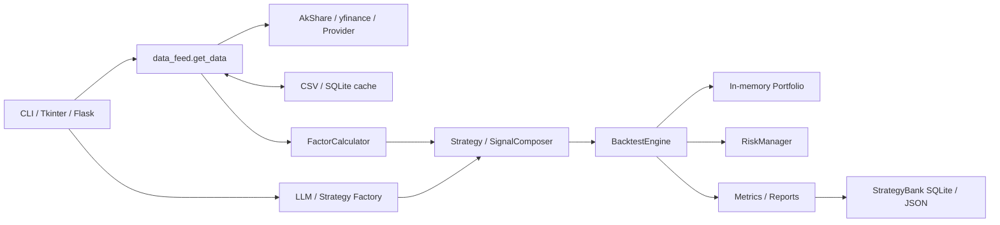

# LXL-QuantAxis Current Architecture Review

## Architecture & Code Audit Report

- 审计快照：`main@b5b36b3a6fcdfcb1a02d4f83341bfdf82cc4fa8e`
- 审计日期：2026-08-03
- 审计方式：只读代码审查、目录/依赖/数据流分析、现有测试执行
- 排除范围：真实 Broker、第三方数据 SLA、生产压测和渗透测试

## 1. Executive Summary

LXL-QuantAxis 已形成覆盖行情、因子、策略、回测、风控、AI、Web/桌面/CLI 和模拟交易的个人量化平台原型，产品宽度已超过普通股票工具。最有价值的资产是证券和市场数据契约、Provider 注册机制、策略/因子原型、Walk-Forward 思路及现有研究体验。主要阻断项位于可信研究内核：回测存在同 Bar 信号与成交偏差，风险没有形成订单前强制闸门，研究结果缺少可复现清单，部分敏感 Web 接口和默认身份配置存在安全暴露。近期应先冻结行为、关闭安全风险、修正回测时钟并建立账本与风险链路，不应继续横向增加策略或预测功能。

总体成熟度：**4.0/10，功能型原型，尚未达到专业团队可信研究平台标准。**

## 2. System Map (High-Level)

### 2.1 组件

| 区域 | 当前职责 | 边界评价 |
|---|---|---|
| `main.py` | CLI 主入口与业务编排 | 入口与业务逻辑耦合 |
| `src/app.py` | Tkinter 桌面应用 | 与 Web/CLI 重复编排 |
| `web_app.py` / `web_modern.py` | Flask Web | 新旧入口并存；现代版同时包含页面、API、线程、SQL、AI 和回测 |
| `src/backtest/` | 数据、回测、指标、优化、压力测试 | 研究内核雏形；时钟和会计语义需修正 |
| `src/strategies/` | 策略基类与策略库 | 算法可保留；接口需统一 |
| `src/factors/` | 技术/基本面因子、组合与衰减 | 可保留计算；需版本、横截面和 PIT |
| `src/risk/` | 止损、回撤、Kelly、Risk Parity、Black-Litterman | 算法原型存在；没有成为强制订单闸门 |
| `src/execution/` | 随机盘口、冰山拆单、成交模拟 | 只能作为实验原型 |
| `src/ai/` | LLM、助手、情绪、策略生成和进化 | 缺结构化约束、证据、版本和审批 |
| `src/data/` / `src/database/` | CSV、SQLite、JSON、SQLAlchemy | 多套持久化并行，事务与所有权分裂 |
| `src/realtime/` | 采集、实时引擎和 K 线 | 生命周期与 Web 线程耦合 |
| `src/core/` | 插件和任务队列原型 | 尚未成为强制内核边界 |
| `tests/` | 数据契约测试 | 188 项通过；核心投资链路无覆盖 |

### 2.2 数据流



UI 可跨越领域边界直接访问数据和数据库；风险与执行不是不可绕过的管道；研究工件没有统一 Run ID；事件时间与数据可得时间未完整分离。

### 2.3 当前能力

- A 股、港股、美股、指数和宏观数据接入。
- 市场元数据、交易日历、证券代码标准化和 Provider Registry。
- 15 类策略、18 类技术因子、基本面因子与组合器原型。
- 逐日回测、手续费/滑点、Grid Search、Walk-Forward、压力与基准比较。
- 移动止损、回撤熔断、Kelly、Risk Parity 和 Black-Litterman。
- AI 对话、交易复盘、市场分析、策略生成、遗传搜索和策略银行。
- Flask、Tkinter、CLI、多用户、日报、推荐和模拟交易大厅。

### 2.4 能力评分

| 模块 | 分数 | 主要缺口 |
|---|---:|---|
| Data | 5.5/10 | PIT、快照、血缘、质量 SLA |
| Research | 3.5/10 | 正式研究工作流、证据和版本 |
| Factor | 4.5/10 | 横截面标准化、因子版本和稳健性 |
| Strategy | 5.0/10 | 统一契约、Manifest 和生命周期 |
| Backtest | 3.5/10 | 时钟、成交、账本和市场规则 |
| Portfolio | 3.0/10 | 不可变账本和统一估值 |
| Risk | 3.0/10 | Pre-trade 强制闸门和组合限制 |
| Execution | 2.5/10 | 订单状态机、对账和 Broker Port |
| AI / Memory | 3.0/10 | Schema、证据、评估和人工确认 |
| Dashboard | 4.0/10 | 权限、Application Service 和维护边界 |

## 3. Findings (Triaged)

### 3.1 Critical (Must Fix)

#### [C-01 同 Bar 信号与成交偏差]

- **Evidence:** `src/backtest/engine.py:260-264` 将当前 Bar 交给策略，`307-345` 又以同一 Bar 的 `close` 为成交基价。
- **Why it matters:** 收盘后计算的信号不能无摩擦地按同一收盘价成交，会系统性高估历史绩效。
- **Recommendation:** 引入 `ResearchClock`、`available_at` 和 `earliest_execution_at`；默认 `close(t)` 生成信号、下一可交易时点成交。
- **Acceptance Criteria:** 策略不能访问未来数据；成交时间晚于信号可得时间；黄金样本结果可重复。
- **Owner Suggestion:** Delivery Engineer Agent + QA Release Gate Agent。

#### [C-02 风控不在订单之前]

- **Evidence:** `src/backtest/engine.py:347-389` 先执行交易，`408-416` 才更新回撤和检查熔断；`RiskManager.can_open_new/add_position/check` 未形成主流程强制门。
- **Why it matters:** 违反风险规则的订单仍可能产生 Fill，持仓风控状态也可能与账本脱节。
- **Recommendation:** 固定 `Signal -> OrderIntent -> PreTradeRisk -> Approved/Rejected -> Execution -> Ledger -> PostTradeRisk`。
- **Acceptance Criteria:** 违规订单从未成交；拒单保留规则版本和原因码；回测与 Paper 共用风险契约。
- **Owner Suggestion:** Delivery Engineer Agent + Security Agent + QA Release Gate Agent。

#### [C-03 Web 权限和默认身份配置不安全]

- **Evidence:** `web_modern.py:2520-2755` 的部分 AI、策略、数据库和策略库写接口没有统一鉴权；`src/auth/auth.py:24-31` 使用 Secret fallback；`229-264` 提供默认管理员密码；`web_modern.py:3102-3105` 默认监听全部接口并允许开发服务器。
- **Why it matters:** 可能导致匿名高成本调用、数据篡改、账户接管或同网段暴露。
- **Recommendation:** API 默认拒绝；强制高熵 Secret、一次性管理员引导、RBAC/Ownership、限流、审计和生产服务器。
- **Acceptance Criteria:** 缺 Secret 时生产模式拒绝启动；权限矩阵测试通过；日志不输出凭据；默认只绑定 loopback。
- **Owner Suggestion:** Security Agent + DevOps Agent + QA Release Gate Agent。

#### [C-04 研究不可完整复现]

- **Evidence:** `src/backtest/engine.py:322-329` 使用未注入种子的随机成交；遗传搜索无固定实验种子；回测记录缺数据快照、Commit、依赖、成本模型和策略版本。
- **Why it matters:** 两次研究可能得出不同结果，历史报告无法重放。
- **Recommendation:** 创建不可变 `DatasetSnapshot` 和 `ResearchRun Manifest`；所有随机源显式注入 seed。
- **Acceptance Criteria:** 相同 Manifest 的指标、成交和报告 Hash 一致；任意历史报告可重放。
- **Owner Suggestion:** Delivery Engineer Agent + QA Release Gate Agent。

### 3.2 Major

#### [M-01 多入口与超大 Web 模块]

- **Evidence:** `main.py`、`src/app.py`、`web_app.py`、`web_modern.py` 分别编排业务；`web_modern.py` 约 3,105 行。
- **Why it matters:** 修复只落在部分入口，权限、缓存和结果口径持续分叉。
- **Recommendation:** 提取 Application Service；入口只做校验、调用和序列化。
- **Acceptance Criteria:** 同一用例在 CLI/Web/Tkinter 返回相同领域结果；Route 不直连物理数据库。
- **Owner Suggestion:** Delivery Engineer Agent。

#### [M-02 存储和配置分裂]

- **Evidence:** SQLAlchemy、直接 SQLite、CSV 和 JSON 并存；新数据入口支持跨平台目录，但 Web 仍多处固定 `D:/trading_data`。
- **Why it matters:** 事务、迁移、备份和组织隔离无法统一。
- **Recommendation:** Typed Settings、Storage/Repository Port、Migration 和统一数据目录。
- **Acceptance Criteria:** 业务模块不解析物理路径；迁移可升级/回滚；备份恢复演练通过。
- **Owner Suggestion:** Delivery Engineer Agent + DevOps Agent。

#### [M-03 Execution 仿真语义不可信]

- **Evidence:** `src/execution/engine.py` 从 OHLCV 随机合成盘口和成交率；卖出复用买入逻辑；缺 T+1、涨跌停、停牌、部分成交状态和对账。
- **Why it matters:** Paper 结果不能代表实际可交易性。
- **Recommendation:** 订单状态机、Paper Broker Port、市场规则插件和 Fill 驱动账本。
- **Acceptance Criteria:** 买卖使用正确对手盘；状态合法；A 股市场规则和每日对账测试通过。
- **Owner Suggestion:** Delivery Engineer Agent + QA Release Gate Agent。

#### [M-04 缺少 Point-in-Time 数据]

- **Evidence:** 财务和新闻数据没有系统化 `published_at/available_at/revision_id`，策略可读取当前抓取结果。
- **Why it matters:** 历史研究可能使用尚未发布或后来修订的数据。
- **Recommendation:** 统一 `event_time/available_at/ingested_at/revision_id`，查询强制 `as_of`。
- **Acceptance Criteria:** 历史日只能读取当时已知版本；修订不覆盖旧快照；PIT 测试通过。
- **Owner Suggestion:** Delivery Engineer Agent + QA Release Gate Agent。

#### [M-05 核心链路缺少测试和 CI]

- **Evidence:** 188 项测试集中在数据目录、证券代码、市场元数据、Provider 和宏观数据；未发现 `.github/workflows`。
- **Why it matters:** 现有测试不能证明回测、账本、风险、执行、AI 或鉴权正确。
- **Recommendation:** 建立单元、契约、集成、黄金回测、安全和 E2E 测试，并由 CI 强制执行。
- **Acceptance Criteria:** PR 必须通过核心门禁；关键风险分支有测试。
- **Owner Suggestion:** QA Release Gate Agent + DevOps Agent。

#### [M-06 策略和 AI 缺少版本治理]

- **Evidence:** Strategy Bank 缺不可变版本谱系；遗传策略在同一数据上反复选择最高 Sharpe；AI 输出可直接进入保存流程。
- **Why it matters:** 过拟合、版本覆盖和未经确认的 AI 规则可能污染研究。
- **Recommendation:** Strategy/Version 分离；训练/验证/测试；AI 只创建 Draft，人工确认并通过 Promotion Gate。
- **Acceptance Criteria:** 已发布版本不可修改；每个版本关联源笔记、Prompt/模型、快照和样本外结果。
- **Owner Suggestion:** Delivery Engineer Agent + Security Agent + QA Release Gate Agent。

#### [M-07 指标、性能和错误处理不利于扩展]

- **Evidence:** 指标混用数值和格式化字符串；回测循环复制历史切片并可能重算因子；宽泛异常被静默处理。
- **Why it matters:** 指标排序易错，大股票池性能下降，故障可能被伪装为无信号。
- **Recommendation:** 领域层返回类型化数值；因子预计算/增量计算；长任务异步；定义异常层级和结构化日志。
- **Acceptance Criteria:** 无字符串反解析；固定性能基准；无裸 `except`；关键错误带关联 ID。
- **Owner Suggestion:** Delivery Engineer Agent + DevOps Agent。

### 3.3 Minor

#### [m-01 版本与文档漂移]

- **Evidence:** README v5.0、Web v5.0/5.5、Config v0.3、Architecture v0.4，模块注释出现 6.x/7.0。
- **Why it matters:** 无法判断部署、代码和文档对应关系。
- **Recommendation:** 单一版本源，README/CHANGELOG/Architecture 由发布流程校验。
- **Acceptance Criteria:** 版本从一处生成；文档 CI 通过。
- **Owner Suggestion:** DevOps Agent。

#### [m-02 仓库噪声]

- **Evidence:** 根目录存在无语义文件 `8` 和空 `_inline_js.js`。
- **Why it matters:** 可能误导构建和维护者。
- **Recommendation:** 引用检查后在独立 Commit 清理。
- **Acceptance Criteria:** 全库引用为零，删除后测试通过。
- **Owner Suggestion:** Delivery Engineer Agent。

## 4. Architectural Recommendations

### 4.1 保留并升级

| 资产 | 处理方式 |
|---|---|
| 证券代码、市场元数据、Provider、宏观数据 | 保留并迁入 `data/contracts` |
| `data_feed.py` 统一入口 | 包装为 Data Provider Port |
| 现有策略算法 | 通过 Legacy Strategy Adapter 迁移 |
| 技术/基本面因子计算 | 迁入版本化 Factor Registry |
| Grid Search、Walk-Forward、压力测试 | 重接可信 Backtest API |
| Risk Parity、Black-Litterman | 作为 Research Analytics 保留 |
| Web 产品工作流 | 保留体验，替换后台调用 |
| AI 复盘、策略银行 | 升级为 Alpha Memory |

### 4.2 必须重构或替换

- `web_modern.py` 业务逻辑拆为薄 Route 和 Application Service。
- 回测建立显式 Research Clock、Event Queue 和 next-tradable-time。
- In-memory Portfolio 替换为 Fill 驱动不可变账本。
- Risk 变成 Pre-trade Policy Chain。
- 随机 ExecutionEngine 降级为实验 Adapter，新建订单状态机与 Paper Broker。
- 多套物理存储统一到 Repository、Catalog、Migration 和 Storage Adapter。
- AI 输出使用 JSON Schema、证据、版本、人工确认和 Promotion Gate。

### 4.3 迁移方式

采用模块化单体和 Strangler Pattern：先建立新契约、特征测试和兼容 Adapter，再按数据、回测、账本、风险、策略、AI 和 UI 顺序迁移。禁止全量重写或一次性目录搬迁。只有出现独立团队、独立 SLO 或有数据证明的容量瓶颈时才评估拆服务。

## 5. Operational Readiness & Observability

当前缺持久化指标、Trace、统一关联 ID、SLO、Runbook 和发布回滚门禁。V2 需要：

- `request_id`、`research_run_id`、`dataset_snapshot_id`、`strategy_version_id`。
- 交易链路额外记录 `signal_id`、`risk_decision_id`、`client_order_id`、`fill_id`。
- 数据成功率、延迟、新鲜度、缺失率和 PIT 违规。
- 回测耗时、失败率、可复现失败和样本内外差距。
- 风控拒单、规则命中、集中度、回撤和风险预算。
- 订单延迟、拒单、部分成交、滑点和对账差异。
- AI 成本、Schema 失败、证据覆盖、人工驳回、模型和 Prompt 版本。

发布门槛：未经风险审批订单为 0；Paper 账本差异为 0；同一 Manifest 可复现率 100%；关键数据过期时进入 degraded。

## 6. Refactoring Examples (Targeted)

### 6.1 回测时钟

**Before:**

```text
bar(t) -> strategy uses close(t) -> fill at close(t)
```

**Target:**

```text
BarClosed(t) -> Signal(available_at=t close)
             -> RiskDecision
             -> Order(eligible_at=next session open)
             -> Fill(t+1)
```

### 6.2 风险闸门

**Before:**

```text
Signal -> Fill -> update drawdown -> mark risk signal
```

**Target:**

```text
Signal -> OrderIntent -> PreTradeRisk
                         |-- Rejected(reason, policy_version)
                         `-- ApprovedOrder -> Execution -> Fill -> Ledger
```

### 6.3 类型化绩效

**Before:**

```json
{"最大回撤": "-18.34%", "总收益率": "+42.10%"}
```

**Target:**

```json
{
  "max_drawdown": {"value": -0.1834, "unit": "ratio", "method_version": "2.0.0"},
  "total_return": {"value": 0.421, "unit": "ratio", "method_version": "2.0.0"}
}
```

## 7. Evidence & Telemetry

- 审计提交：`b5b36b3a6fcdfcb1a02d4f83341bfdf82cc4fa8e`。
- 自动测试：`python -m unittest discover -s tests -v`，188/188 通过。
- 重点文件：`src/backtest/engine.py`、`src/backtest/data_feed.py`、`src/backtest/optimizer.py`、`src/backtest/metrics.py`、`src/risk/manager.py`、`src/execution/engine.py`、`src/core/plugin.py`、`src/ai/factory.py`、`src/ai/engine.py`、`src/data/strategy_store.py`、`src/database/models.py`、`src/auth/auth.py`、`web_modern.py`。
- CI：未发现 `.github/workflows`。
- 限制：未运行真实数据下载、长期 Web 压测、渗透测试或 Broker 集成。
